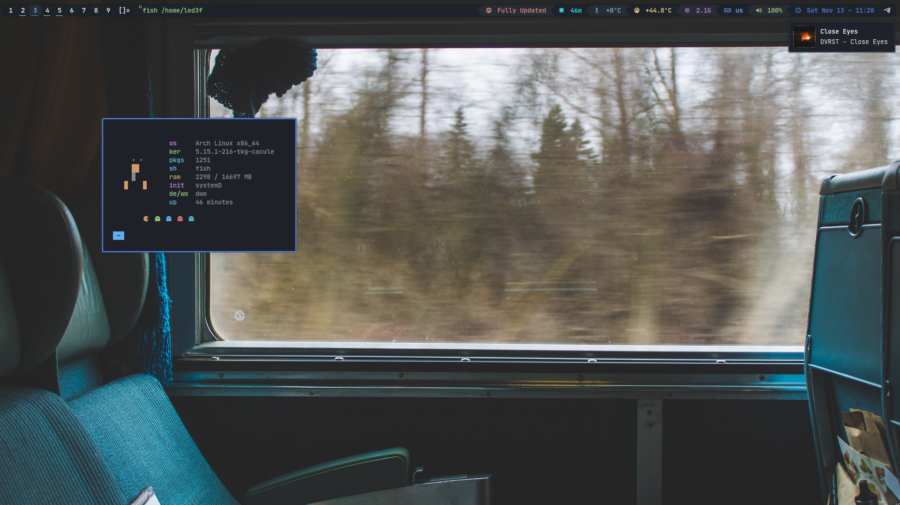

# dwm

# eww

# info

<h1 align="center">🚀✨ Widgets go brr! ✨🚀</h1>

dwm flexipatch - https://github.com/bakkeby/dwm-flexipatch

st flexipatch - https://github.com/bakkeby/st-flexipatch

eww widget theme - https://github.com/adi1090x/widgets

