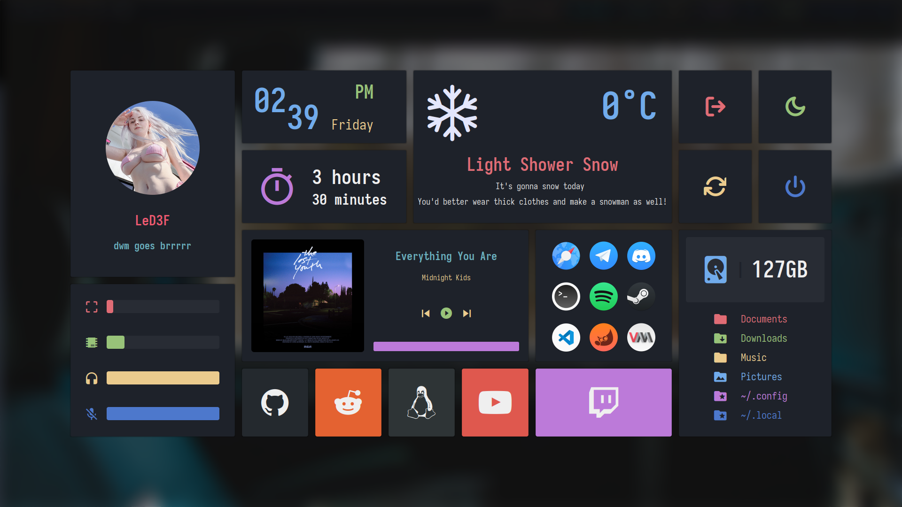

## dwm

## eww

## some info

- **dwm flexipatch** - https://github.com/bakkeby/dwm-flexipatch

- **st flexipatch** - https://github.com/bakkeby/st-flexipatch

- **eww widgets theme** - https://github.com/adi1090x/widgets

- **dwmblocks** - https://github.com/torrinfail/dwmblocks

## dependencies

- **Fonts:** JetBrains Mono, JetBrainsMono Nerd Fonts, Iosevka, Iosevka Nerd Fonts, SFPro and Feather.
- **Eww:** You can find eww launcher in my .dots repo.
- **Rofi**
- **Greenclip:** For clipboard in rofi.
- **Picom:** You can use any picom fork, but i recommend to use this fork with patch for shadows with rounded corners https://github.com/s0nny7/picom
- **Dunst:** for notifications.
- **Nitrogen:** wallpaper setup tool.
- **Easyeffects:** AutoEQ for headphones.
- **Zenpower:** cpu temperature info.
- **Spotify:** music plugin in eww works only with this player, but you can configure it for yourself.
- **xautolock**: for inhibitors

## configuration

- **About EWW:**: This config for 1920x1080 resolution, so you should change it by yourself for preffered resolution.
- **Important:** Go to my .dots repo and clone bin folder and place it in your PATH, without it scripts won't work and change.  
- **EWW:** Go to scripts folder and change preferences for your hardware and apps of your choice.
- **Updates in dwmblocks:** update scripts works only for arch and arch based distros, change command for updates that applies to your distribution.
- **Weather in dwmblocks:** change wttr.in location to yours.
- **Autostart script:** place .dwm folder in your HOME directory and make script executable.

## keybinds

|              Keybind            |                 Function                 |
| ------------------------------- | ---------------------------------------- |
| `Super + Enter`                 | Launch terminal                          |
| `Super + B`                     | Hide bar                                 |
| `Super + J/K`                   | Focus Left or Right Stack                |
| `Super + S`                     | Swap focus on left or right stack        |
| `Super + H/L`                   | Change size of master stack.             |
| `Super + Shift + H/L/O`         | Set the size of windows in all stacks.   |
| `Super + Shift + J/K`           | Move stacks in tags.                     |
| `Super + Tab`                   | Show previous tag                        |
| `Super + Shift + C`             | Kill client                              |
| `Super + Shift + Q`             | Quit dwm                                 |
| `Super + Control + Shift + Q`   | Restart DWM                              |
| `Super + T`                     | Set tiling layout                        |
| `Super + F`                     | Set floating layout                      |
| `Super + M`                     | Set monocle layout                       |
| `Super + Shift + Space`         | Toggle floating                          |
| `Super + Y`                     | Toggle fullscreen                        |
| `Super + Shift + Comma/Period`  | Cycle available layouts                  |
| `Super + 0`                     | Show all windows from tags               |
| `Super + Comma/Period`          | Focus left or right monitor              |
| `Super + Control + Comma/Period`| Tag left or right monitor                |
| `Super + E`                     | Open EWW Panel                           |
| `Super + Shift + E`             | close EWW Panel                          |
| `Super + D`                     | Open rofi launcher menu                  |
| `Super + Shift + A`             | Open rofi clipboard menu                 |
| `Super + F1`                    | lockscreen                               |
| `Super + X`                     | Start inhibitor                          |
| `Super + Shift + X`             | disable inhibitor                        |
| `PrintScr`                      | Copy screenshot to clipboard             |
| `Super + PrintScr`              | Save screenshot to folder                |

**Note**: There is also a keybing file in dwm source code folder.
